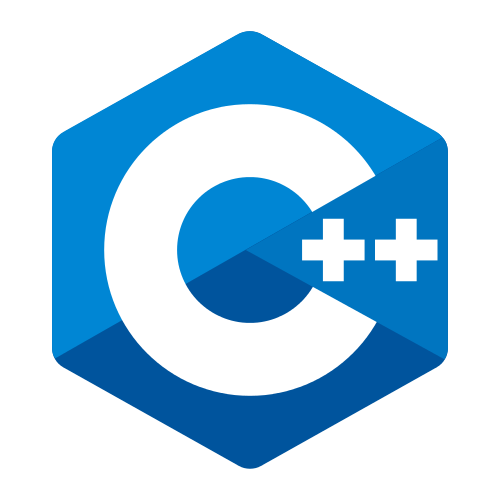
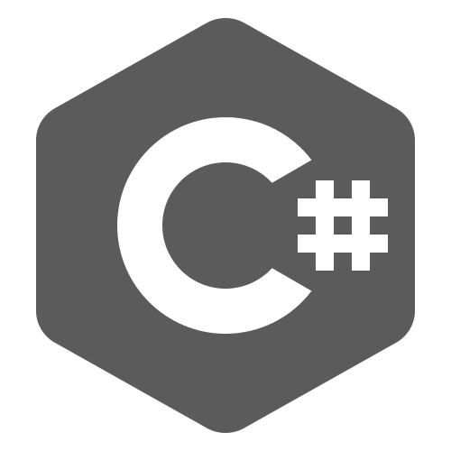
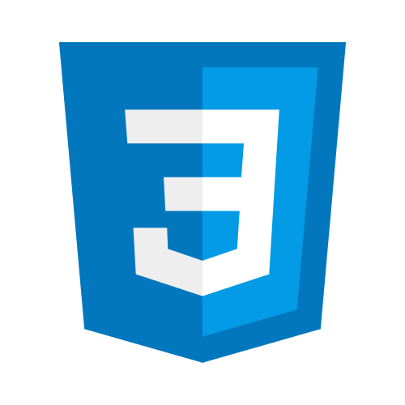
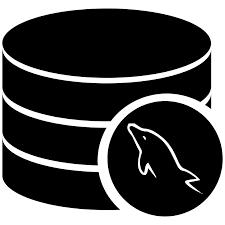
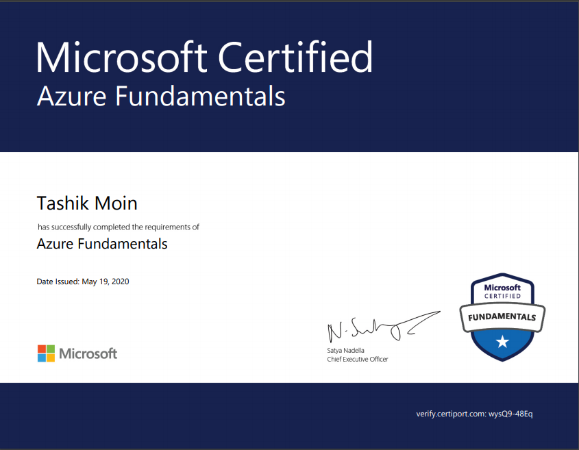
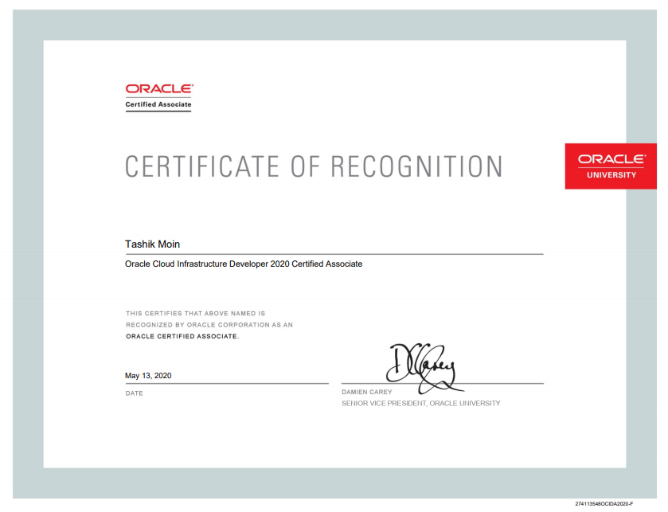

## 👋 Hi there! I am Tashik Moin. 
 

      <h6>
            Prioritizing product and customer requirements, defining the product vision, and working closely 
            with the IT and support departments to ensure revenue and customer satisfaction goals are met.
      </h6>
 

     
## 🏫 Experience:

<h5> - Cloud Analyst at Plugcloud, INC </h5>
<h5> - Microsoft Certified Trainer (MCT) </h5>
<h5> - Microsoft Gold Student Ambassador (GMLSA) </h5>
 <h5> - Microsoft Certified Solutions Associate (MCSA) </h5>
<h5> - Microsoft Certified Professional (MCP) </h5>
<h5> - Microsoft Office Specialist (MOS) </h5>
<h5> - Microsoft Technology Associate (MTA) </h5>

## 🏫 Other Achievements:

<h5> - BSCS Dean's List Spring 2019 </h5>
<h5> - BSCS Dean's List Spring 2020 </h5>
<h5> - BSCS Dean's List Fall 2020 </h5>

      

## 🚀 Skills And Interests:

## 🔤 Languages:

## :gear: Frameworks:

 
 
 

## 🛠 Tools:

## 📖 Certifications And Awards:

## My Github stats:

